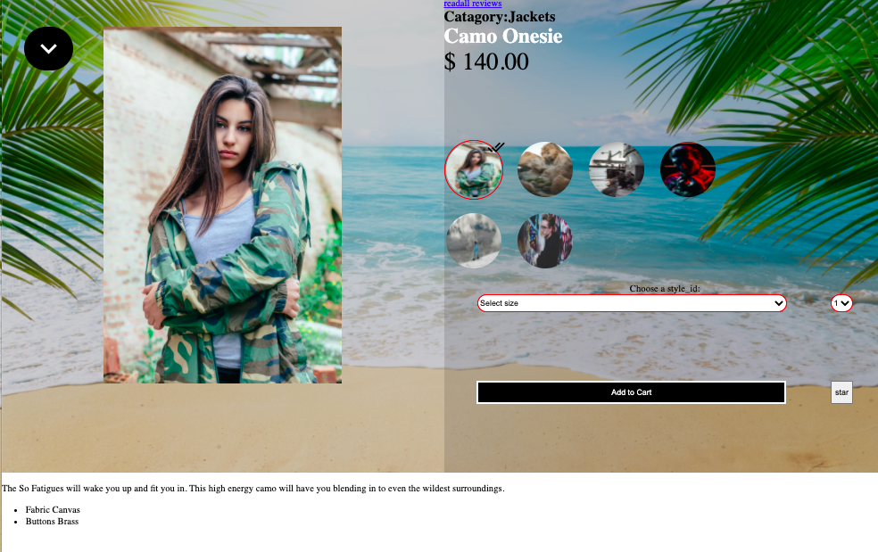

<h1 align="center"> The overview wigit</h1>

<p align="center">
  
  <br>
  <i>Overview is a wiget where a customer can overview the product details. the most important details of them all.
  </i>
  <br>
</p>

## Documentation
Getting started with how to use this wigits code;


### API MODEL

#how to import the model;

```javascript
# this model connects to the backend to make requests for data
import Model from 'pathtomodelFile';
var newModel = new Model(false|true);
# if you choose false then you are not ready to deploy and the functionality may be slightly diffrent.

```

### STATE


